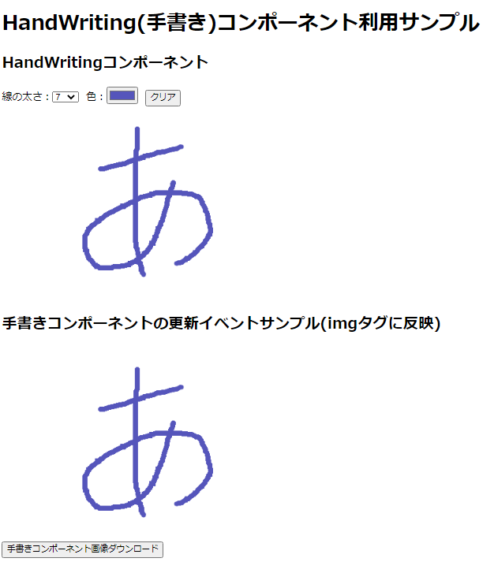

# Reactで手書きコンポーネント

[お試しページ(github pages)](https://murasuke.github.io/hand-writing-react-component/)



## canvasをReactで利用するためのポイント

* canvasはDOMオブジェクトを直接操作する必要があるため`useRef`フックで利用する

* canvasの大きさはCSSではなく属性で設定する。

```typescript
  const canvas = useRef(null);

  <canvas ref={canvas}
    width={props.width} height={props.height}
    onMouseDown={mouseDown} 
    ～～～ 以下省略 ～～～
```

* コンポーネントは描画完了イベント(onUpdateCanvas)をコールバックする
  * 呼び出し元で、画像のダウンロードなどで利用できる。

## 機能

* 手書きでお絵描きをするコンポーネントです。マウスドラッグ中に線を引きます。
* マウスタッチイベントにも対応しました。

* propsで下記機能を利用できます
  1. 線の太さ、色を変更可能(lineHeigh, lineColor)
  1. コンポーネントのサイズを指定する(width, height)
  1. クリアプロパティ(clear: boolean)を変更すると領域をクリアします(親コンポーネントのから子コンポーネントの機能を呼び出す方法がこれしか思いつかなかった。functionコンポーネントでやり方あるんですかね？)
  1. 1本ごと線描画完了時に、onUpdateCanvas(canvas)をコールバックします。
      
      ⇒ 引数canvasでDOM自体を引き渡します。利用側で画像をダウンロードするなど出来ます。


## コンポーネントの仕組み

* 手書きコンポーネントソース全体
  * ドラッグ中(mouseDown⇒mouseMove)、もしくはタッチ中(onTouchStart⇒onTouchMove)に線を描画します
  * マウスを離す(onMouseUp)か、canvas領域から出る(onMouseLeave)と線描画を終了します
  * useEffectで`props.clear`の値変更を監視し、canvasをクリアします
  * マウスイベントとタッチイベントハンドラを共通ロジックとするため、新しいイベントハンドラ型を定義しています
  ```typescript
    type MouseOrTouchEventHandler<T = Element> = React.EventHandler<React.MouseEvent<T>| React.TouchEvent<T>>;
  ```
  * タッチイベントではoffsetが取得できないため、offsetPosition()メソッドで取得するように切り出し、イベント処理を共有化しています
  ```typescript
    // offset(canvas左上からの)を返す。Touch,Mouseイベント両対応
  const offsetPosition =  (e : React.MouseEvent | React.TouchEvent) => {
    if (e.nativeEvent instanceof TouchEvent) {
      const rect = (e.target as any).getBoundingClientRect();      
      const offsetX = (e.nativeEvent.touches[0].clientX - window.pageXOffset - rect.left);
      const offsetY = (e.nativeEvent.touches[0].clientY - window.pageYOffset - rect.top);
      return { offsetX, offsetY };
    } else if (e.nativeEvent instanceof MouseEvent) {
      return { offsetX: e.nativeEvent.offsetX ,offsetY: e.nativeEvent.offsetY };
    }
  }
  ```


```typescript
import React, { useRef, useState, useEffect } from "react";

/**
 * 手書きコンポーネントprops定義
 */
export type HandWritingAttribute = {
  width?: number,
  height?: number,
  lineWidth?: number,
  lineColor?: string,
  lineCap?: CanvasLineCap,
  clear?: boolean,
  onUpdateCanvas?: (e: HTMLCanvasElement) => void,
}

/**
 * 手書きコンポーネント(ドラッグ中線を描画する)
 * ・props経由で、線の太さ、色を指定
 * ・onUpdateCanvas()で線描画毎にコールバック
 * ・props.clearの値をトグルする毎にクリア
 * @param props 
 * @returns 
 */
const HandWriting: React.FC<HandWritingAttribute> = (props) => {
  // canvasはDOMを直接操作するためuseRef()経由で操作する
  const canvas = useRef(null);
  // ドラッグ中判断フラグ(マウスを離すか、canvas外へ出たらfalse)
  const [drawing, setDrawing] = useState(false);

  // 領域クリア用。親コンポーネントでclearの値を変更するとcanvasをクリアする(toggle時常にクリア)
  useEffect(() => {
    const ctx = (canvas.current as HTMLCanvasElement).getContext('2d');
    if( ctx ) {
      ctx.clearRect(0, 0, props.width, props.height);
      if (props.onUpdateCanvas) props.onUpdateCanvas(canvas.current);
    }
  }, [props.clear]);

  // 描画に必要なcontextを取得し、線の色、幅をセットする
  const getContext = () => {
    const ctx = (canvas.current as HTMLCanvasElement).getContext('2d');
    ctx.lineWidth = props.lineWidth;
    ctx.lineCap = props.lineCap;
    ctx.strokeStyle = props.lineColor;
    return ctx;
  }
  
  type MouseOrTouchEventHandler<T = Element> = React.EventHandler<React.MouseEvent<T>| React.TouchEvent<T>>;

  // 線描画開始処理。beginPath()で新しいパスを開始する(開始しないと色や太さが変更できない)
  const drawStart: MouseOrTouchEventHandler = (e) =>  {
    const { offsetX: x ,offsetY: y } = offsetPosition(e);
    setDrawing(true);
    const ctx = getContext();
    ctx.beginPath();
    ctx.moveTo(x, y);
  }

  // 動きに合わせて線を描画する
  const drawMove: MouseOrTouchEventHandler = (e) => {
    if (!drawing) return;
    const { offsetX: x ,offsetY: y } = offsetPosition(e);
    const ctx = getContext();
    ctx.lineTo(x, y);
    ctx.stroke();
  } 

  // 線描画完了(canvas更新イベントコールバックを行う)
  const endDrawing = () => {
    setDrawing(false);
    if (props.onUpdateCanvas) props.onUpdateCanvas(canvas.current);
  }

  // offset(canvas左上からの)を返す。Touch,Mouseイベント両対応
  const offsetPosition =  (e : React.MouseEvent | React.TouchEvent) => {
    if (e.nativeEvent instanceof TouchEvent) {
      const rect = (e.target as any).getBoundingClientRect();      
      const offsetX = (e.nativeEvent.touches[0].clientX - window.pageXOffset - rect.left);
      const offsetY = (e.nativeEvent.touches[0].clientY - window.pageYOffset - rect.top);
      return { offsetX, offsetY };
    } else if (e.nativeEvent instanceof MouseEvent) {
      return { offsetX: e.nativeEvent.offsetX ,offsetY: e.nativeEvent.offsetY };
    }
  }

  return (
    <>
      <canvas ref={canvas}
        width={props.width} height={props.height}
        onMouseDown={drawStart} 
        onMouseMove={drawMove} 
        onMouseUp={endDrawing}
        onMouseLeave={endDrawing}
        onTouchStart={drawStart} 
        onTouchMove={drawMove} 
        onTouchEnd={endDrawing} />
    </>
  );
};

// propsのデフォルト値を設定
HandWriting.defaultProps = {
  width: 500,
  height: 300,
  lineWidth: 10,
  lineColor: "rgb(100, 100, 100)",
  lineCap: "round",
};

export default HandWriting;

```

## 利用方法

* 利用サンプルソース全体

```typescript
import React from 'react';
import HandWriting from './HandWrinting';

function App() {
  const [dataUrl, setDataUrl] = React.useState(null);
  const [settings, setSettings] = React.useState({lineWidth:7, lineColor: '#5555bb', clear: false})
  
  // 画像コンポーネント更新コールバック
  const onUpdateCanvas = (e: HTMLCanvasElement) => {
    // 画像をstateに保存し下記の用途で利用する
    //  ⇒タグに表示
    //  ⇒画像のダウンロード
    setDataUrl(e.toDataURL('image/png'));
  }

  // 画像ダウンロード
  const downloadCanvasImage = () => {
    const dlLink = document.createElement("a"); 
    dlLink.href = dataUrl;
    dlLink.download = 'handwriting.png';
    dlLink.click();
    dlLink.remove();  
  }

  // 手書きコンポーネント線の幅変更
  const setLineWidth = (e:  React.ChangeEvent<HTMLSelectElement>) => {
    setSettings( prev => {
      return {...prev, lineWidth: parseInt(e.target.value, 10)}
    });
  }

  // 手書きコンポーネント線の色変更
  const setColor= (e:  React.ChangeEvent<HTMLInputElement>) => {
    setSettings( prev => {
      return {...prev, lineColor: e.target.value}
    });
  }

  // 手書きコンポーネントクリア
  const clearComponent= () => {
    setSettings( prev => {
      return {...prev, clear: !prev.clear}
    });
  }

  const lineWidth = [1,2,3,5,7,10,14,20];
  return (
    <>
      <h1>HandWritingコンポーネント利用サンプル</h1>
      <div>
        <h2>HandWritingコンポーネント</h2>
          <div>
            <label htmlFor="lineWidth">線の太さ：</label>
            <select name="lineWidth" value={settings.lineWidth} onChange={setLineWidth}>
              {lineWidth.map((i) =><option key={i} value={i}>{i}</option>)}
            </select>
            &nbsp;&nbsp;
            <label htmlFor="lineColor">色：</label>
            <input name="lineColor" type="color" value={settings.lineColor} onChange={setColor}></input>
            &nbsp;&nbsp;
            <button onClick={clearComponent}>クリア</button>
          </div>
          <HandWriting onUpdateCanvas={onUpdateCanvas} {...settings} />
      </div>
      <div>
        <h2>HandWritingの更新イベントサンプル(画像更新時にimgタグに反映)</h2>
          
      </div>
      <div>
        <button type="button" onClick={downloadCanvasImage}>
          HandWriting画像のダウンロード
        </button>
      </div>
    </>
  );
}

export default App;
```
### 画像をimgタグに反映する

* Canvasの更新コールバックで、画像に変換しタグに表示します

* dataUrlは画像をbase64エンコーディングした文字列がセットされます。 

  data:image/png;base64,iVBORw0KGgoAAAANSUhEUgAAAfQA～

```typescript
  // 画像コンポーネント更新コールバック
  const onUpdateCanvas = (e: HTMLCanvasElement) => {
    // 画像をstateに保存し下記の用途で利用する
    //  ⇒タグに表示
    //  ⇒画像のダウンロード
    setDataUrl(e.toDataURL('image/png'));
  }

```

```typescript
  
```

### 画像のダウンロード

* dataUrlにセットした画像データをダウンロードするため<a>を動的に生成します。

```typescript
  // 画像ダウンロード
  const downloadCanvasImage = () => {
    const dlLink = document.createElement("a"); 
    dlLink.href = dataUrl;
    dlLink.download = 'handwriting.png';
    dlLink.click();
    dlLink.remove();  
  }

```

## 参考にしたサイト
[Reactからcanvasを使って絵を書く](https://qiita.com/ebkn/items/af3b53f560eb023a200f)

  classコンポーネントをfunctionに書き換え、イベント処理を追加しました。

